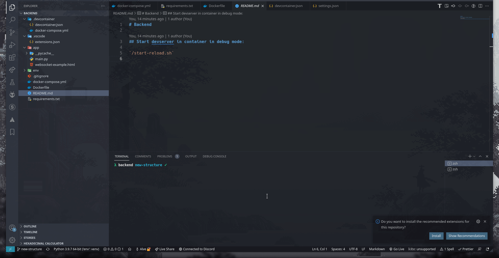

# AAQC Backend

Server backend for the drones.

## Building & Running

Build the container with: `$ docker-compose build` 
Start the container with: `$ docker-compose up` 

## Forward the database from remote host using SSH:

`ssh -NL 0.0.0.0:3306:0.0.0.0:3306 $SERVER_HOST`

## How to install and use with VSCode

## Start devserver in container in debug mode:

`/start-reload.sh`
